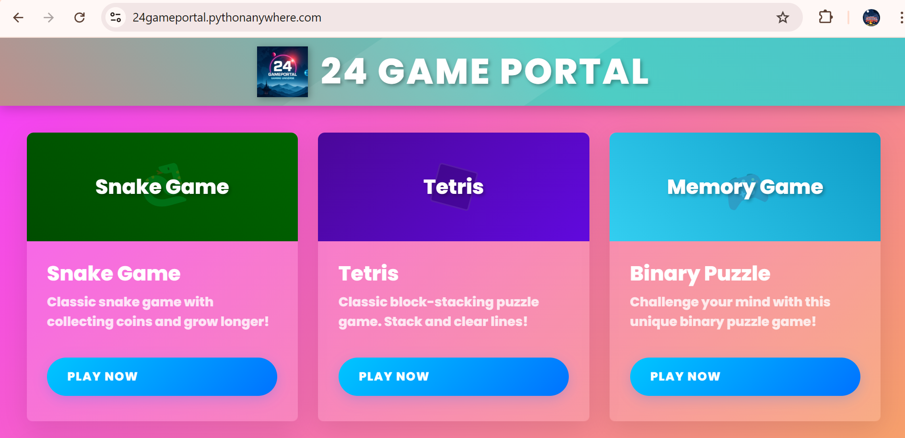
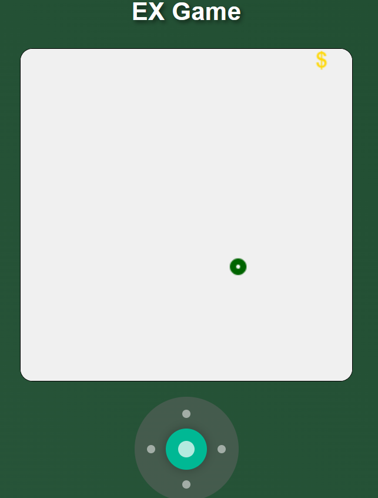
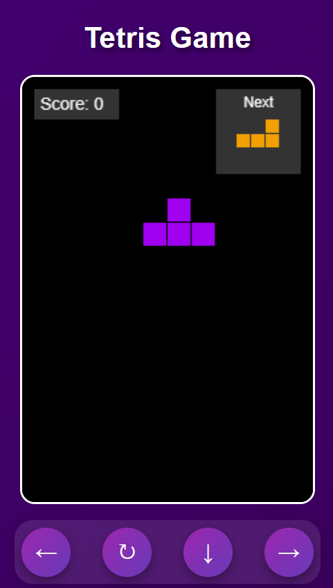
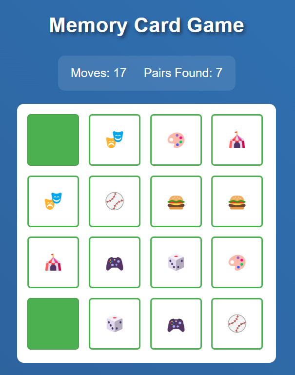
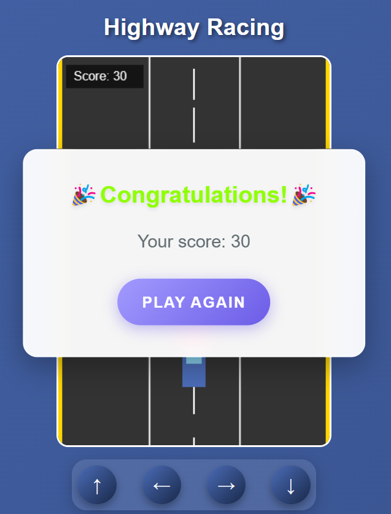

#24 Game Portal 🎮

## 🔗 Live

Check out the live Website [24gameportal](https://24gameportal.pythonanywhere.com/)!

## 🛠️ Tech Stack

- **Frontend:** HTML
- **Backend:** Python

## 🌟 Features

- **Engaging Games:** Enjoy a variety of games designed for relaxation and fun.
- **Interactive UI:** User-friendly interface for a seamless gaming experience.
- **Relaxation:** Unwind with games that are both entertaining and relaxing.

## 📸 Live Images

  
  
  
  
  

## 🏆 Inspiration

"Gaming === Relaxing"

This project is a testament to the power of gaming in providing relaxation and entertainment.

## 👨‍💻 Made by Me

This project is a result of my passion for gaming and development. Feel free to connect with me:

- [Email](mailto:pradeepbangari24@gmail.com) - [LinkedIn](https://www.linkedin.com/in/pradeep-bangari24/)

## 🤝 Contributing

Contributions are welcome! If you'd like to contribute, please fork the repository and submit a pull request.

## 📜 License

This project is licensed under the MIT License. See the [LICENSE](LICENSE) file for details.

#ESCN
